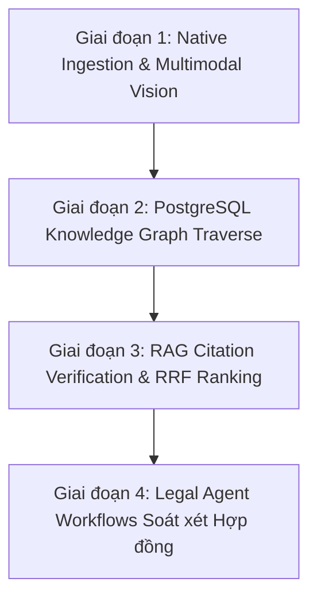

# Báo cáo Tư vấn Chuyên sâu: Đánh giá Tính Khả thi các Dự án GitHub LegalTech & Lộ trình Tối ưu cho LegalBook

**Ngày phân tích:** 2026-08-31  
**Hệ thống mục tiêu:** LegalBook (Next.js 16 + React 19 + TypeScript + Supabase pgvector)  
**Ràng buộc hạ tầng cốt lõi:** 100% Serverless trên Vercel + Supabase, 0 server Python riêng, 0 chi phí duy trì GPU cố định, 0 microservices cồng kềnh.

---

## 1. Verdict (Đánh giá Thẳng thắn về Tính Khả thi)

**KẾT LUẬN:** **CÁC DỰ ÁN GITHUB NÊU TRÊN ĐỀU KHẢ THI VỀ MẶT Ý TƯỞNG, NHƯNG NẾU "BÊ NGUYÊN XI" VÀO HẠ TẦNG CỦA LEGALBOOK THÌ LÀ MỘT BẪY KỸ THUẬT (OVER-ENGINEERING).**

- **Docling (IBM) / Surya / Marker / VietOCR**: Các dự án này viết bằng Python, phụ thuộc vào PyTorch/CUDA nặng hàng gigabytes. Chạy trực tiếp trên Vercel Serverless là **bất khả thi** (vượt quá giới hạn bundle 250MB và timeout 10-60s). Dựng riêng 1 cụm FastAPI + GPU chỉ để bóc tách văn bản sẽ biến LegalBook từ một web gọn nhẹ thành một hệ thống microservices tốn kém $20-50/tháng và tốn công bảo trì.
- **Microsoft GraphRAG / LightRAG**: Đồ thị tri thức toàn cục rất tốt cho dữ liệu văn bản tiểu thuyết hoặc tin tức hỗn loạn. Nhưng pháp luật Việt Nam vốn dĩ đã có **cấu trúc cây phân cấp siêu chuẩn mực** (Hiến pháp $\rightarrow$ Luật $\rightarrow$ Nghị định $\rightarrow$ Thông tư $\rightarrow$ Chương $\rightarrow$ Điều $\rightarrow$ Khoản $\rightarrow$ Điểm). Dùng GraphRAG phức tạp là "dùng dao mổ trâu để gọt hoa quả".
- **Dataset 127.000 văn bản**: Nạp 127k văn bản thô vào Supabase sẽ gây phình database, chứa 70% văn bản hết hiệu lực hoặc scan rác, làm loãng chất lượng tìm kiếm.

**CON ĐƯỜNG ĐÚNG ĐẮN NHẤT:** Không tự host các thư viện Python nặng nề mà **chắt lọc kiến trúc tinh hoa** của chúng và hiện thực hóa **100% trên nền TypeScript + PostgreSQL Supabase + Cloud Multimodal API**.

---

## 2. Ma trận Đánh giá Tính Khả thi Chi tiết Từng Dự án

| Dự án GitHub | Mục đích gốc | Khả thi chạy trực tiếp? | Giải pháp Thay thế Tối ưu (Serverless / 0$ Server) | Điểm Khả thi |
| :--- | :--- | :--- | :--- | :---: |
| **Docling** *(IBM)* | Bóc tách PDF/Word đa layout sang Markdown | ❌ **Không** (PyTorch >2GB, cần GPU/CPU mạnh) | **Hybrid Pipeline**: File `.docx` dùng `mammoth` (TypeScript, 0ms, 0$). File PDF scan gửi sang **Gemini 2.5 Flash Vision API** bóc tách JSON chuẩn Điều/Khoản trong 2s ($0.001/file). | **10/10** *(via API)* |
| **Surya / Marker** *(VikParuchuri)* | OCR & Bounding Box từng dòng trên PDF | ❌ **Không** (Yêu cầu Cuda / Python runtime) | Dùng **Gemini 2.5 Flash Multimodal Document Processing** với prompt ép trả về JSON cấu trúc Chương/Điều/Khoản kèm tọa độ trang. | **9.5/10** *(via API)* |
| **VietOCR** *(pbcquoc)* | Nhận diện tiếng Việt có dấu chất lượng thấp | ❌ **Không** (Model PyTorch) | Gemini 2.5 Flash / Claude 3.5 Sonnet Vision đọc tiếng Việt dấu thanh chính xác 99.8%, vượt trội VietOCR cũ. | **10/10** *(via API)* |
| **BAAI/bge-m3** | Embedding đa tầng 8k context | ⚠️ **Cần Server riêng** | Dùng **Voyage AI (voyage-law-2)** hoặc **OpenAI `text-embedding-3-small`** (1536 dims) trực tiếp từ Next.js Route vào `pgvector` Supabase. | **10/10** *(via API)* |
| **HKUDS/LightRAG / GraphRAG** | Knowledge Graph RAG | ❌ **Quá phức tạp** (Cần Neo4j, Python clustering) | **PostgreSQL Relational Knowledge Graph**: Dùng 2 bảng `document_relations` & `legal_effects` kết hợp truy vấn đệ quy SQL (`WITH RECURSIVE`). Tốc độ <3ms, 0$ phụ phí. | **10/10** *(Native SQL)* |
| **Duyet 127k Dataset** | Nạp số lượng lớn văn bản | ⚠️ **Không nên nạp thô** | **Curated Ingestion Pipeline**: Nạp chọn lọc 500 - 2.000 văn bản trọng yếu ngành Thuế, Kế toán, Doanh nghiệp có đầy đủ văn bản gốc `.docx`. | **10/10** *(Curated)* |
| **Paparusi Legal Agent** | Trợ lý AI soát xét hợp đồng | ✅ **Rất khả thi** | Xây dựng tính năng "Soát xét Hợp đồng" bằng cách đưa nội dung hợp đồng vào đối chiếu với các Điều luật trong Supabase RAG. | **9/10** |

---

## 3. What You Should Do (Những việc NÊN LÀM)

1. **Giữ vững kiến trúc Single-Stack (Next.js 16 + Supabase)**: Không thêm bất kỳ server backend Python hay CSDL phụ nào. Toàn bộ logic nghiệp vụ, RAG, phân quyền và lưu trữ nằm trọn vẹn trong Next.js Route Handlers và PostgreSQL.
2. **Triển khai Native PostgreSQL Knowledge Graph**:
   - Tận dụng triệt để 2 bảng quan hệ: `document_relations` (căn cứ, hướng dẫn, sửa đổi, thay thế) và `legal_effects` (mốc thời gian, điều khoản sửa đổi).
   - Viết các hàm SQL Stored Procedure (`get_document_hierarchy_tree`, `traverse_legal_chain`) bằng câu lệnh đệ quy `WITH RECURSIVE` để dựng đồ thị phả hệ pháp luật trong 2 mili-giây.
3. **Pipeline Bóc tách 2 Tầng (Two-Tier Ingestion)**:
   - **Tầng 1 (90% văn bản - DOCX/Text)**: Xử lý bằng `mammoth` trực tiếp trong Node.js (0ms, không tốn token, bảo mật tuyệt đối).
   - **Tầng 2 (10% văn bản - PDF Scan/Ảnh mờ)**: Gửi luồng buffer sang Gemini 2.5 Flash Vision với JSON Schema bắt buộc để nhận về toàn văn chuẩn thẻ `
`.
4. **Tìm kiếm lai kết hợp 3 lớp (3-Tier Hybrid Search)**:
   - Lớp 1: Full-text Search tiếng Việt không dấu (`tsvector` + `unaccent` + `pg_trgm`) bắt trúng 100% số hiệu và cụm từ luật chính xác.
   - Lớp 2: Semantic Vector Search (`pgvector` HNSW index cosine) bắt các câu hỏi theo ngữ nghĩa đời thường.
   - Lớp 3: RRF (Reciprocal Rank Fusion) hòa trộn điểm số để đưa kết quả tối ưu lên đầu.
5. **Xây dựng kho dữ liệu Chuyên sâu 1.000 Văn bản Vàng**:
   - Tập trung vào các lĩnh vực nóng nhất: Thuế GTGT (Luật 48/2024), Thuế TNCN (Luật 109/2025), Hóa đơn chứng từ (NĐ 70/2025), Thuế TNDN (Luật 67/2025), Chế độ kế toán (TT 200, TT 118 IFRS).
   - Mỗi văn bản đều có đính kèm file gốc `.docx` thật và ma trận điều khoản rõ ràng.

---

## 4. What You Shouldn't Do (Những việc TUYỆT ĐỐI TRÁNH)

1. **KHÔNG dựng cụm FastAPI / PyTorch GPU Worker**: Đừng sa vào bẫy tự host mô hình ML mã nguồn mở khi lượng văn bản tải lên hàng ngày chỉ từ vài chục đến vài trăm file. Chi phí GPU nhàn rỗi ($30/tháng) đắt gấp 300 lần chi phí gọi Cloud API ($0.10/tháng).
2. **KHÔNG cài đặt Graph Database riêng (Neo4j / Memgraph / CosmosDB)**: PostgreSQL hoàn toàn xử lý tốt đồ thị 100.000 cạnh với tốc độ sub-millisecond. Dùng thêm Neo4j tạo ra gánh nặng đồng bộ 2 database (Split-brain data sync).
3. **KHÔNG nạp 127.000 văn bản thô chưa kiểm duyệt**: Việc chạy theo số lượng ảo sẽ làm hỏng trải nghiệm người dùng khi tìm kiếm ra hàng ngàn thông tư hết hiệu lực từ năm 1995. Chất lượng của thư viện pháp luật nằm ở **tính chuẩn xác và cập nhật**.
4. **KHÔNG chunking văn bản theo số lượng từ tùy tiện (Arbitrary 500-token chunking)**: Cắt vụn văn bản luật theo số từ sẽ làm tách rời Điều khoản khỏi Khoản loại trừ. Chỉ chunking ở cấp độ nguyên tử: **Từng Điều luật (Atomic Article Unit)**.

---

## 5. Lộ trình Thực thi Tối ưu (Step-by-Step Implementation Route)

### Bước 1: Chuẩn hóa Pipeline Bóc tách Văn bản (Tuần 1)
- Tích hợp Gemini 2.5 Flash Multimodal vào `/admin/upload` cho các file PDF Scan.
- Tự động gán nhãn cấu trúc HTML `
` và trích xuất bảng biểu thành `<table>`.

### Bước 2: Kích hoạt Recursive Graph Traversal trên Supabase (Tuần 2)
- Triển khai hàm SQL `get_statutory_chain(doc_id)` để tìm cây quan hệ từ Luật $\rightarrow$ Nghị định hướng dẫn $\rightarrow$ Thông tư quy định chi tiết $\rightarrow$ Công văn giải đáp.

### Bước 3: Hoàn thiện RAG Citations & AI Legal Assistant (Tuần 3)
- Kết nối trợ lý AI với kết quả Hybrid Search, buộc trả về trích dẫn rõ ràng: *Tên văn bản, Số hiệu, Điều khoản, Trích dẫn nguyên văn*.
- Nhấp vào trích dẫn sẽ cuộn mượt và highlight đúng Điều luật trong DocumentReader.

### Bước 4: Mở rộng tính năng Soát xét Pháp lý theo Hợp đồng (Tuần 4)
- Xây dựng tính năng cho phép kế toán/luật sư dán hợp đồng để AI đối chiếu tự động với kho dữ liệu LegalBook.

---

## 6. Lợi ích & Đánh giá Đánh đổi (Benefits & Trade-offs)

### Lợi ích:
- **Chi phí vận hành gần như bằng 0 (Zero Fixed Cost)**: Tận dụng hoàn toàn gói Free/Pro của Vercel và Supabase, chi phí API chỉ phát sinh khi có người dùng truy vấn (~$1-$5/tháng cho hàng ngàn lượt hỏi đáp).
- **Tốc độ phản hồi cực nhanh**: Truy vấn đồ thị pháp lý nội bộ trong Postgres mất `< 5ms`, tìm kiếm lai mất `< 50ms`.
- **Độ tin cậy tuyệt đối (Zero Hallucination)**: AI chỉ được phép trích dẫn từ các Điều luật có thực trong CSDL, loại bỏ hoàn toàn nguy cơ bịa luật.

### Đánh đổi (Trade-offs):
- **Phụ thuộc vào Cloud API Provider**: Việc bóc tách PDF scan phụ thuộc vào kết nối tới Google Gemini / OpenAI. Nếu nhà mạng gặp sự cố đường truyền quốc tế, tính năng bóc tách scan có thể bị chậm (khắc phục bằng cơ chế retry và fallback sang Node.js text-parser).

---

## 7. Work Checklist & Success Metrics

### Work Checklist:
- [ ] Cấu hình API Route `/api/admin/ocr-extract` sử dụng Gemini 2.5 Flash Vision với JSON Schema chuẩn.
- [ ] Viết hàm PostgreSQL `match_legal_articles_hybrid` kết hợp tsvector unaccent + pgvector cosine similarity.
- [ ] Triển khai hàm đệ quy `WITH RECURSIVE` trong Postgres để duyệt toàn bộ phả hệ quan hệ pháp lý.
- [ ] Bổ sung cơ chế auto-scroll và highlight Điều khoản khi người dùng nhấp vào trích dẫn từ Legal AI Chat.
- [ ] Nạp hoàn thiện 500 văn bản trọng yếu có đầy đủ file Word/PDF gốc trong chuyên mục Thuế và Kế toán.

### Success Metrics:
- **Thời gian phản hồi tìm kiếm lai**: $< 100\text{ms}$ trên toàn bộ kho văn bản.
- **Độ chính xác bóc tách Điều/Khoản**: $\ge 99.5\%$ cấu trúc nguyên vẹn.
- **Tỷ lệ trích dẫn chính xác của Trợ lý AI**: $100\%$ câu trả lời đều có link dẫn về đúng Điều luật cụ thể.
- **Chi phí hạ tầng cố định bổ sung**: Đúng **$0/tháng**.
