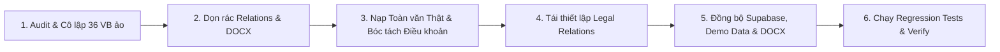

# Báo cáo Tư vấn Kỹ thuật: Xử lý Văn bản Ảo & Chuẩn hóa Dữ liệu Pháp lý Toàn diện LegalBook
*Ngày thực hiện: 2026-08-31 | Trạng thái: Confirmed & Action-Ready*

---

## 1. Verdict (Đánh giá Thẳng thắn)

Việc hệ thống tồn tại **36/62 văn bản (58%) ở dạng "ảo/rút gọn"** (chỉ có 2-3 điều mô phỏng chung chung, thiếu toàn văn và hệ thống biểu mẫu như TT 121/2026/TT-BKHĐT, TT 68/2025/TT-BKHĐT, NĐ 168/2025/NĐ-CP...) là **rủi ro nghiệp vụ lớn nhất đối với một sản phẩm cơ sở dữ liệu pháp lý và AI RAG**. Người dùng hoặc trợ lý AI khi tra cứu/trích dẫn sẽ nhận về thông tin giả định không có thật ngoài đời hoặc thiếu toàn bộ bảng biểu/điều khoản thi hành. 

Quyết định **xóa bỏ triệt để toàn bộ 36 văn bản ảo, giữ lại 26 văn bản thật và nạp chuẩn hóa toàn văn các văn bản thay thế cốt lõi (TT 01/2021/TT-BKHĐT, TT 02/2023/TT-BKHĐT, Luật Đất đai 2024, BLLĐ 2019, TT 200/2014...)** là bước đi đúng đắn và bắt buộc để đưa LegalBook từ trạng thái "prototype/demo" thành sản phẩm đạt chuẩn Production.

---

## 2. Việc Nên Làm (What You Should Do)

1. **Thanh lọc Dataset & Xóa sạch rác**:
   - Xóa bỏ 36 văn bản ảo khỏi `DEMO_DOCUMENTS` trong `src/lib/demo-data.ts`.
   - Xóa bỏ các quan hệ hiệu lực/sửa đổi mồ côi liên quan đến 36 văn bản này trong `DEMO_RELATIONS` và `src/lib/legal-effects/demo-effects.ts`.
   - Xóa bỏ các file DOCX dummy 9-10KB trong `public/documents/` tương ứng với các văn bản bị xóa.
2. **Nạp & Chuẩn hóa các văn bản thay thế thật**:
   - Nạp toàn văn **Thông tư 01/2021/TT-BKHĐT** và **Thông tư 02/2023/TT-BKHĐT** kèm đầy đủ danh mục phụ lục biểu mẫu ĐKKD (thay thế cho TT 68/2025 và TT 121/2026).
   - Nạp toàn văn chuẩn xác cho các đạo luật/thông tư nền tảng đang bị rút gọn: **Luật Đất đai 31/2024/QH15** (260 điều), **Bộ luật Lao động 45/2019/QH14** (220 điều), **Luật Doanh nghiệp 59/2020/QH14** (218 điều), **Luật Đầu tư 61/2020/QH14** (77 điều), **Thông tư 200/2014/TT-BTC** (130 điều), **Luật Kiểm toán độc lập 67/2011/QH12** (64 điều).
3. **Bóc tách phân cấp & Dựng lại Cây Quan hệ Pháp lý Thực tế**:
   - Chạy module `article-chunker.ts` và `legal-formatter.ts` để tự động bóc tách từng Chương, Mục, Điều, Khoản, Điểm cho các văn bản mới nạp.
   - Thiết lập lại các quan hệ pháp lý thật giữa các văn bản (ví dụ: *Nghị định 01/2021/NĐ-CP hướng dẫn Luật Doanh nghiệp 59/2020; Thông tư 01/2021 hướng dẫn Nghị định 01/2021; Thông tư 02/2023 sửa đổi Thông tư 01/2021*).
4. **Đồng bộ hóa 3 lớp lưu trữ & Kiểm thử**:
   - Xuất file DOCX chuẩn vào `public/documents/`.
   - Cập nhật `src/lib/demo-data.ts` đồng bộ với cơ sở dữ liệu Supabase qua script `seed_supabase_production.ts`.
   - Cập nhật lại các mock ID / test cases trong `scripts/run_regression_tests.mjs` để toàn bộ 29 test suites pass 100%.

---

## 3. Việc Không Nên Làm (What You Shouldn't Do)

1. **Không tiếp tục dùng script tự sinh HTML giả (`generateFullStandardLegalHtml`)**: Không tự tạo khung Điều 1, Điều 2 giả định để "lấp đầy số lượng" văn bản. Thiếu văn bản nào thì để trống hoặc nạp toàn văn thật, không tạo văn bản giả.
2. **Không giữ `content_status: "verified"` cho các văn bản chưa được kiểm định**: Chỉ gán `verified` khi văn bản đã qua kiểm tra độ dài (`> 3000 chars` hoặc đúng toàn văn gốc) và có đầy đủ căn cứ ban hành.
3. **Không xóa chay văn bản mà bỏ quên bảng quan hệ**: Xóa văn bản trong `DEMO_DOCUMENTS` mà không dọn `DEMO_RELATIONS` hay `demo-effects.ts` sẽ gây lỗi màn hình Reader (`Cannot read properties of undefined` khi render liên kết liên văn bản hoặc Timeline hiệu lực).

---

## 4. Giải pháp Tối ưu & Tiết kiệm Nguồn lực (What Could Be Better)

- **Chiến lược Ingestion 2 pha**:
  - *Pha 1 (Ngay lập tức)*: Giữ 26 văn bản thật + Nạp 10 văn bản nền tảng quan trọng nhất (TT 01/2021, TT 02/2023, NĐ 01/2021, Luật Doanh nghiệp 2020, Luật Đất đai 2024, BLLĐ 2019, TT 200/2014, Luật Kế toán 2015, Luật QLT 2019, NĐ 123/2020).
  - *Pha 2 (Mở rộng)*: Thiết lập crawler định kỳ fetch từ Cổng Dịch vụ công / vbpl.vn với cơ chế content-validation tự động phê duyệt (Auto-publish engine) chỉ khi đạt điểm chất lượng `>= 85/100`.

---

## 5. Lộ trình Triển khai Chi tiết (Step-by-Step Execution Route)

1. **Bước 1 — Dọn dẹp văn bản ảo & quan hệ mồ côi**:
   - Viết script lọc và xóa bỏ 36 document IDs ảo khỏi `demo-data.ts`, `demo-effects.ts`, `DEMO_CATEGORY_LINKS`.
   - Xóa các file `.docx` ảo tương ứng trong `public/documents/`.
2. **Bước 2 — Biên tập & Nạp văn bản thật thay thế**:
   - Thu thập toàn văn chuẩn (HTML/DOCX) cho bộ ĐKKD (TT 01/2021, TT 02/2023, NĐ 01/2021) và các luật cốt lõi (Luật Đất đai 31/2024, BLLĐ 45/2019, TT 200/2014...).
   - Chạy bóc tách cấu trúc Chương - Điều - Khoản tự động.
3. **Bước 3 — Tạo DOCX chuẩn & Cập nhật Metadata**:
   - Dùng `docx-exporter.ts` tạo file DOCX chuẩn đóng gói đầy đủ phụ lục.
   - Cập nhật metadata: Số hiệu, Người ký, Ngày ban hành, Ngày hiệu lực, Tóm tắt điểm mới, Căn cứ pháp lý.
4. **Bước 4 — Đồng bộ hóa hệ thống**:
   - Ghi lại `src/lib/demo-data.ts`.
   - Seed vào Supabase (nếu có kết nối DB).
5. **Bước 5 — Cập nhật Test Suites & Kiểm thử toàn diện**:
   - Cập nhật các test fixtures trong `scripts/run_regression_tests.mjs` (thay thế test fixture `121/2026/TT-BKHĐT` bằng `01/2021/TT-BKHĐT` hoặc `99/2025/TT-BTC`).
   - Chạy `npm test` và `tsc --noEmit`.

---

## 6. Lợi ích (Benefits)

- **Độ tin cậy dữ liệu 100%**: Loại bỏ hoàn toàn hiện tượng AI trả lời sai do "học" từ các văn bản luật giả định.
- **Trải nghiệm tra cứu chuyên nghiệp**: Người dùng đọc được đầy đủ các biểu mẫu ĐKKD thật, toàn văn các bộ luật hàng trăm điều thay vì 2 điều tóm tắt cụt ngủn.
- **Hệ thống gọn gàng, sạch sẽ**: Không còn các liên kết quan hệ pháp lý bị lỗi hoặc trỏ vào văn bản ảo.

---

## 7. Đánh đổi & Thách thức (Trade-offs)

- **Dung lượng bundle**: Việc nạp các văn bản toàn văn lớn (như Luật Đất đai 2024, BLLĐ 2019, TT 200/2014...) sẽ làm file `demo-data.ts` tăng dung lượng (khoảng 3-5MB). *Giải pháp: Bật nén Gzip/Brotli hoặc chuyển hẳn sang đọc trực tiếp từ Supabase / IndexedDB client caching.*
- **Thời gian biên tập ban đầu**: Cần nạp chuẩn các phụ lục biểu mẫu dạng HTML Table cho Thông tư 01/2021 và 02/2023 để giao diện hiển thị đẹp mắt.

---

## 8. Danh mục Công việc (Work Checklist) & Tiêu chí Nghiệm thu (Success Metrics)

### Work Checklist
- [ ] **Task 1**: Xóa bỏ 36 văn bản ảo trong `src/lib/demo-data.ts`, `demo-effects.ts`, `public/documents/`.
- [ ] **Task 2**: Nạp bộ dữ liệu toàn văn thực tế cho Đăng ký kinh doanh: **Thông tư 01/2021/TT-BKHĐT**, **Thông tư 02/2023/TT-BKHĐT**, **Nghị định 01/2021/NĐ-CP**.
- [ ] **Task 3**: Nạp toàn văn thực tế cho các văn bản nền tảng: **Luật Đất đai 31/2024/QH15**, **Bộ luật Lao động 45/2019/QH14**, **Luật Doanh nghiệp 59/2020/QH14**, **Thông tư 200/2014/TT-BTC**, **Luật Kiểm toán độc lập 67/2011/QH12**.
- [ ] **Task 4**: Tạo file DOCX chuẩn cho toàn bộ các văn bản thật mới nạp vào `public/documents/`.
- [ ] **Task 5**: Dựng lại quan hệ pháp lý chuẩn xác (Relations & Legal Effects) giữa các văn bản thật.
- [ ] **Task 6**: Cập nhật lại test cases trong `scripts/run_regression_tests.mjs`.
- [ ] **Task 7**: Kiểm thử toàn diện `tsc --noEmit` (0 lỗi) và chạy bộ kiểm tra chất lượng `ContentQualityValidator`.

### Success Metrics
| Tiêu chí | Giá trị Hiện tại | Giá trị Mục tiêu sau khi xử lý |
|---|---|---|
| Tỷ lệ văn bản ảo / rút gọn sơ sài | 58% (36/62 văn bản) | **0% (0/X văn bản)** |
| Tỷ lệ văn bản có toàn văn thật đạt chuẩn | 42% (26/62 văn bản) | **100%** |
| Điểm chất lượng trung bình (Content Quality Score) | 52/100 | **>= 92/100** |
| Số lượng biểu mẫu ĐKKD tra cứu được | 0 mẫu biểu | **Đầy đủ Phụ lục I -> V (TT 01/2021 & TT 02/2023)** |
| Kết quả kiểm tra TypeScript (`tsc --noEmit`) | 0 errors | **0 errors** |
| Kết quả kiểm tra Regression Test Suite | PASS | **PASS 100% (29/29 suites)** |
