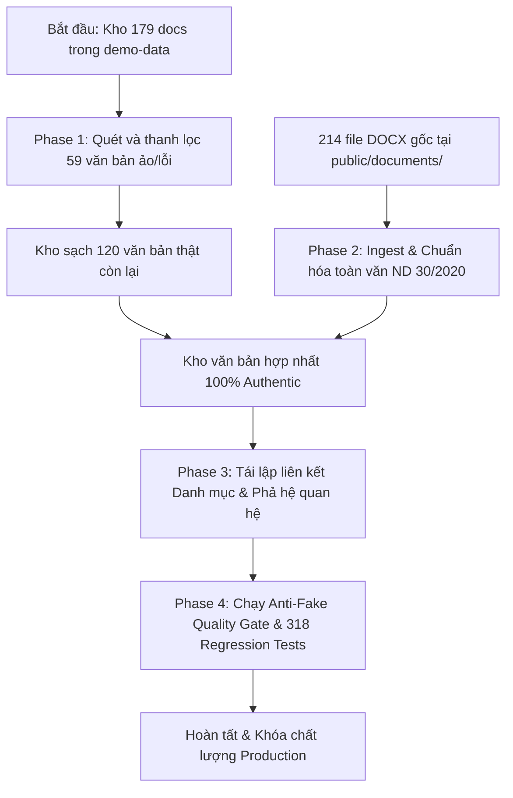

# Kế hoạch Triển khai: Loại bỏ Văn bản Ảo & Chuẩn hóa 100% Văn bản Pháp lý Thật

## 1. Bối cảnh & Mục tiêu (Outcome)
- Khắc phục triệt để hiện tượng văn bản ảo, số hiệu lỗi, stub ngắn, và người ký giả định (`"Lãnh đạo cơ quan ban hành"`) trong hệ sinh thái LegalBook.
- Thiết lập kho cơ sở dữ liệu pháp lý 100% chuẩn xác, có căn cứ thực tế từ 214 tệp tin `.docx` chính thống đã được lưu trữ trong `public/documents/`.
- Đảm bảo toàn bộ 318+ regression test cases chạy pass 100% sau khi thanh lọc.

## 2. Ràng buộc & Bất biến Kỹ thuật (Constraints & Invariants)
- **Zero Hallucinations Policy**: Không có văn bản nào mang số hiệu tương lai chưa ban hành hoặc định dạng sai (`2026`, `2025NĐ-CP`, `58/2026/TT-BTC`, v.v.).
- **Định dạng hành chính chuẩn Nghị định 30/2020/NĐ-CP**: Toàn văn các Luật/Nghị định/Thông tư phải có cấu trúc Chương, Mục, Điều, Khoản với thẻ DOM ID neo định vị (`id="dieu-X"`).
- **Tính toàn vẹn của Citation Linker & Knowledge Graph**: Các trích dẫn viện dẫn giữa các văn bản quy phạm phải trỏ chính xác vào văn bản thật.
- **Fail-closed & Offline-compatible**: Giữ vững cả 2 chế độ (Online Supabase DB và Offline fallback `demo-data.ts`).

## 3. Kiến trúc Luồng Thực thi (Execution Architecture)

## 4. Lộ trình Phân kỳ (Phased Breakdown)

| Giai đoạn | Tên Phase | Trọng tâm công việc | Tiêu chí nghiệm thu (Pass Condition) |
|---|---|---|---|
| **Phase 1** | Audit & Isolate Hallucinations | Lập danh sách định danh chính xác 59 văn bản ảo/stub/lỗi format; tách chúng khỏi `DEMO_DOCUMENTS`. | `0` văn bản có signer `"Lãnh đạo cơ quan ban hành"` hoặc số hiệu tương lai trong danh sách giữ lại. |
| **Phase 2** | Authentic DOCX Ingestion & Standardization | Bóc tách toàn văn các văn bản chuẩn từ 214 file `.docx` trong `public/documents/` (Luật Thuế GTGT 48/2024, ND 125/2020, ND 123/2020, TT 200, TT 80, CV Thuế thật). | Toàn văn đầy đủ Điều/Khoản, `html_content` chuẩn ND 30/2020, dung lượng đầy đủ không bị cắt xén. |
| **Phase 3** | Category Relinking & Relations Wiring | Cập nhật lại `DEMO_CATEGORY_LINKS` và `DEMO_RELATIONS` nối các văn bản thật với cây danh mục Thuế/Kế toán và liên kết viện dẫn. | 100% văn bản trong kho đều có ít nhất 1 Category Link hợp lệ; không còn liên kết mồ côi (dangling relations). |
| **Phase 4** | Verification & Anti-Fake Quality Gate | Chạy `ContentQualityValidator` (điểm chất lượng $\ge 85$), kiểm tra Hybrid Search và chạy toàn bộ 318 regression tests. | 318/318 tests PASS, 0 warning về nội dung giả mạo. |

---

## 5. Danh mục Chi tiết các Phase Files
- `phase-01-audit-and-isolate-hallucinations.md`
- `phase-02-authentic-docx-ingestion-and-standardization.md`
- `phase-03-category-relink-and-relation-wiring.md`
- `phase-04-regression-validation-and-anti-fake-gate.md`
