# Kế hoạch Nâng cấp: Trải nghiệm Đọc Chuẩn mực & Chế độ Đối chiếu Song song (Dual Split View)

## 1. Bối cảnh & Vấn đề Cần giải quyết (The Why)
Qua ảnh chụp thực tế màn hình LegalBook trên máy tính (`legalbook-six.vercel.app`), 4 vấn đề làm suy giảm trải nghiệm người dùng nghiêm trọng gồm:
1. **Banner lỗi vàng trên cùng**: `Lỗi truy vấn văn bản: TypeError: Failed to fetch` do Supabase offline nhưng `data-service.ts` văng lỗi thay vì fallback mượt về 130 văn bản thật.
2. **Nội dung bị rác & lặp đoạn**: Lặp 3 lần cụm *"Kính gửi Cục Thuế"*, lặp ngày tháng và còn sót chữ ký giả định thừa như *"Lãnh đạo cơ quan ban hành (Đã ký điện tử)"*.
3. **Khung đọc quá hẹp trên máy tính**: 2 cột điều hướng bên trái chiếm hơn 560px, khiến trang văn bản bị bóp vụn, đọc mỏi mắt, không có cảm giác thoải mái như xem văn bản in gốc.
4. **Thiếu chế độ đối chiếu trực diện giữa 2 văn bản**: Người dùng không thể mở song song 2 văn bản để so sánh đối chiếu từng điều khoản (ví dụ: Công văn so với Nghị định, hoặc Thông tư cũ vs Thông tư mới).

## 2. Kiến trúc Giải pháp (Solution Architecture)

```mermaid
flowchart TD
    subgraph Data Layer
        A[data-service.ts: Supabase call fail] -->|Bắt lỗi âm thầm| B[Fallback ngay lập tức về 130 Authentic Docs]
        B --> C[Loại bỏ 100% Banner lỗi Failed to fetch]
    end

    subgraph Content Sanitizer
        D[Raw HTML Content] --> E[cleanAdministrativeHtml Engine]
        E -->|Cắt bỏ lặp Kính gửi / Ngày tháng| F[Nội dung tinh gọn]
        E -->|Xóa bỏ ký thừa giả định| F
        F --> G[Layout chuẩn Nghị định 30/2020]
    end

    subgraph Desktop Reading UI
        H[Cột 1: Chuyên đề] -->|Tự động gập nhỏ khi đọc| I[Thu hẹp về 64px Icon Rail]
        J[Nút Tập trung & Tràn viền] --> K[Mở rộng 100% Khung đọc A4]
    end

    subgraph Dual Split View
        L[Thanh công cụ: Nút 'Đọc đối chiếu song song'] --> M[Màn hình Split View 50% - 50%]
        M --> N[Bên Trái: Văn bản chính]
        M --> O[Bên Phải: Văn bản đối chiếu]
        M --> P[Khóa cuộn đồng bộ Sync Scroll & Tìm kiếm độc lập]
    end
```

## 3. Lộ trình Phân kỳ 4 Giai đoạn (Phased Implementation)

### Phase 1: Graceful Fallback & Xóa bỏ Banner Lỗi (`phase-01-graceful-fallback-and-error-banner-removal.md`)
- Sửa `src/lib/data-service.ts`: Khi Supabase fetch bị lỗi (`fetch failed`, timeout, network error), hệ thống **tự động fallback âm thầm** về `DEMO_DOCUMENTS` (130 văn bản thật), không set `error` và không hiển thị banner màu vàng gây khó chịu cho người dùng.
- Bảo vệ `app/page.tsx`: Chỉ hiển thị `dataError` khi cả Supabase lẫn embedded data đều hoàn toàn rỗng.

### Phase 2: Administrative HTML Cleaner & Deduplication Engine (`phase-02-administrative-html-cleaner-and-deduplication.md`)
- Phát triển bộ tiền xử lý `cleanAdministrativeHtml(html, doc)`:
  - Nhận diện và cắt bỏ các đoạn text lặp *"Kính gửi..."*, lặp ngày tháng địa danh từ quá trình trích xuất OCR trước đây.
  - Xóa bỏ các dòng ký rác giả định: `Lãnh đạo cơ quan ban hành`, `Thủ trưởng cơ quan (Đã ký điện tử)` nằm lạc lõng trong phần body.
  - Áp dụng trực tiếp vào `src/lib/demo-data.ts` và bộ render `DocumentReader.tsx` / `HTMLViewer.tsx`.

### Phase 3: Desktop Wide Reading & Auto-Collapse Navigation (`phase-03-desktop-wide-reading-and-auto-collapse-navigation.md`)
- Tối ưu không gian desktop:
  - Khi người dùng chọn 1 văn bản để bắt đầu đọc, tự động thu gọn Cột 1 (CategoryTree) thành dạng **Icon Rail (64px)**, giải phóng hơn 200px cho khung đọc.
  - Thêm nút chuyển đổi nhanh (Toggle Rail / Expand).
  - Tinh chỉnh typography văn bản: Căn lề chuẩn trang giấy A4 (max-w-4xl), font chữ hiển thị rõ ràng, giãn dòng 1.65 giúp đọc dễ dàng và tập trung như bản in giấy.

### Phase 4: Dual Document Split View (Chế độ Đối chiếu Song song 50/50) (`phase-04-dual-document-split-view-side-by-side.md`)
- Xây dựng tính năng **"Đọc Đối Chiếu Song Song" (Split View)**:
  - Đặt nút **"Đọc đối chiếu" (Dual Split View)** trực tiếp trên thanh công cụ trên cùng của `DocumentReader.tsx`.
  - Cho phép người dùng chọn bất kỳ văn bản nào trong danh mục hoặc qua tìm kiếm nhanh để làm "Văn bản đối chiếu (Document B)".
  - Giao diện chia đôi màn hình 50% - 50%:
    - Cột trái: Văn bản hiện tại (Document A).
    - Cột phải: Văn bản đối chiếu (Document B).
    - Có nút khóa/mở cuộn đồng bộ (**Sync Scroll**) để so sánh dòng/điều khoản tương ứng.
    - Cho phép đóng đối chiếu bất kỳ lúc nào để quay lại chế độ đọc 1 văn bản toàn màn hình.

---

## 4. Danh mục File Artifacts
- `plans/2026-09-13-reading-ux-dual-compare-overhaul/plan.md`
- `plans/2026-09-13-reading-ux-dual-compare-overhaul/phase-01-graceful-fallback-and-error-banner-removal.md`
- `plans/2026-09-13-reading-ux-dual-compare-overhaul/phase-02-administrative-html-cleaner-and-deduplication.md`
- `plans/2026-09-13-reading-ux-dual-compare-overhaul/phase-03-desktop-wide-reading-and-auto-collapse-navigation.md`
- `plans/2026-09-13-reading-ux-dual-compare-overhaul/phase-04-dual-document-split-view-side-by-side.md`
